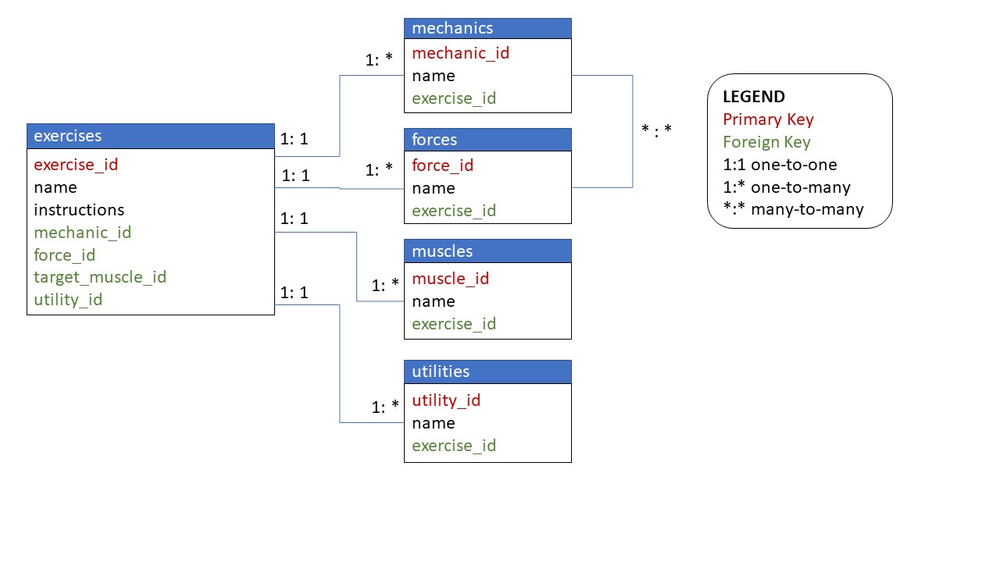

# Exercise Generator by Cassie Eddy

[Link to this repository](https://github.com/cikeddy/SI507_Final)

---

## Project Description

My project will aggregate information about exercises and muscles and will allow a user to input criteria to a form that will be used to randomly select an exercise. The project will allow also users to access information about muscles that exercises activate along with exercise characteristics. There will be a route for the homepage with a greeting and count of number of exercises and muscles in the application. There will be another route where users will be able to enter criteria that will be used to display information about a random exercise. Finally, there will be a route for viewing information about exercises and muscles they are related to. If there is enough time I will add a feature of creating a workout.

## My Database Schema

## How to run

1. Install all requirements with `pip install -r requirements.txt`
2. Run `python SI507project_tools.py` 
3. more steps to come

## How to use (still working on this)

1. A useful instruction goes here
2. A useful second step here
3. (Optional): Markdown syntax to include an screenshot/image: 

## Routes in this application (not yet created)
- `/home` -> this is the home page with a count of exercises
- `/search` -> this route has a form for user input for either searching an exercise by name or randomly
- `/result` -> this route is where the form sends the result and displays information about an exercise
- `/` -> this route is a page with  exercise information

## How to run tests
- make sure you have run the project before running the tests
1. Run `SI507project_tests.py`

## In this repository:
- SI507project_tests.py
- SI507project_tools.py
- advanced_expiry_caching.py

---
## Code Requirements for Grading
Please check the requirements you have accomplished in your code as demonstrated.
- [x] This is a completed requirement.
- [ ] This is an incomplete requirement.

Below is a list of the requirements listed in the rubric for you to copy and paste.  See rubric on Canvas for more details.

### General
- [x] Project is submitted as a Github repository
- [x] Project includes a working Flask application that runs locally on a computer
- [x] Project includes at least 1 test suite file with reasonable tests in it.
- [x] Includes a `requirements.txt` file containing all required modules to run program
- [x] Includes a clear and readable README.md that follows this template
- [x] Includes a sample .sqlite/.db file
- [x] Includes a diagram of your database schema
- [ ] Includes EVERY file needed in order to run the project
- [ ] Includes screenshots and/or clear descriptions of what your project should look like when it is working

### Flask Application
- [ ] Includes at least 3 different routes
- [ ] View/s a user can see when the application runs that are understandable/legible for someone who has NOT taken this course
- [ ] Interactions with a database that has at least 2 tables
- [x] At least 1 relationship between 2 tables in database
- [ ] Information stored in the database is viewed or interacted with in some way

### Additional Components (at least 6 required)
- [ ] Use of a new module
- [ ] Use of a second new module
- [ ] Object definitions using inheritance (indicate if this counts for 2 or 3 of the six requirements in a parenthetical)
- [x] A many-to-many relationship in your database structure
- [x] At least one form in your Flask application
- [x] Templating in your Flask application
- [x] Inclusion of JavaScript files in the application
- [x] Links in the views of Flask application page/s
- [ ] Relevant use of `itertools` and/or `collections`
- [x] Sourcing of data using web scraping
- [ ] Sourcing of data using web REST API requests
- [x] Sourcing of data using user input and/or a downloaded .csv or .json dataset
- [x] Caching of data you continually retrieve from the internet in some way

### Submission
- [x] I included a link to my GitHub repository with the correct permissions on Canvas! (Did you though? Did you actually? Are you sure you didn't forget?)
- [ ] I included a summary of my project and how I thought it went **in my Canvas submission**!
